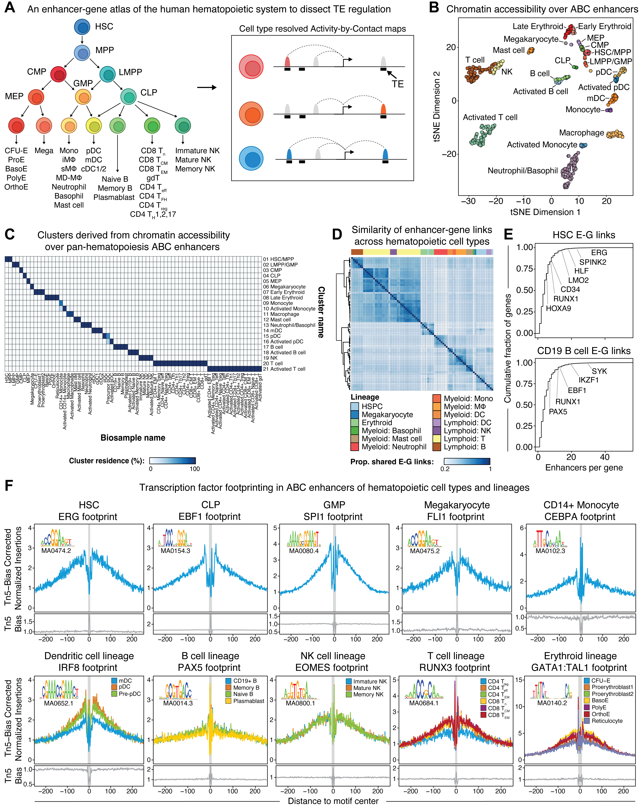

# Enhancer-gene atlas of the human hematopoietic system

## Description
This repository contains a comprehensive atlas of enhancer-gene regulation in the human hematopoietic system. The atlas comprises genome-wide maps for all major hematopoietic cell types and activation states using the Activity-by-Contact (ABC) model (Fulco, et al. 2019 _Nature Genetics_; Nasser, et al. 2021 _Nature_). All enhancer predictions are presented in **hg38 coordinates**. Detailed descriptions of each atlas version are noted below. 

**Note:** If you use this resource, please cite: <citation>

## Version 1
We collected and uniformly processed publicly available epigenomic data on the following cell types and states to build ABC maps:
* Hematopoietic stem and progenitor cells [HSCs, MPPs, LMPPs, CMPs, GMPs, MEPs, CLPs] (Corces, et al. 2016 _Nature Genetics_)
* Erythroid differentiation [CFU-E, Proerythroblast1, Proerythroblast2, Basophilic erythroblast, Polychromatic erythroblast, Orthochromatic erythroblast, Reticulocyte] (Ludwig, et al. 2019 _Cell Reports_)
* Megakaryocytes (Buenrostro, et al. 2018 _Cell_)
* Dendritic progenitor cells (Buenrostro, et al. 2018 _Cell_)
* Immune cells +/- activation [Monocytes, Macrophages, B cell subtypes, T cell subtypes, Natural killer cell subtypes, Plasmablasts, Dendritic cells] (Calderon, et al. 2019 _Nature Genetics_; Buenrostro, et al. 2018 _Cell_; Ulirsch, et al. 2019 _Nature Genetics_; ENCODE Consortium)

**Atlas v1 stats:**
* Enhancer-gene links: 3,793,019
* Biosamples: 258
* Cell-types / states: 65
* Average number of enhancers-per-gene: 3.22+/-0.14
* Pan-hematopoiesis ABC enhancers: 207,648

**Atlas v1 files:**
* [Samplesheet v1](https://github.com/mnajia/Human-Hematopoiesis-Enhancer-Gene-Atlas/blob/main/atlas_v1/Human_Hematopoiesis_ABC_Atlas_v1_samplesheet.txt) - metadata on all biosamples used to build ABC maps
* [Enhancer-Gene Predictions v1](https://github.com/mnajia/Human-Hematopoiesis-Enhancer-Gene-Atlas/blob/main/atlas_v1/Human_Hematopoiesis_ABC_Atlas_v1_hg38.rds) - ABC maps for all cell types and states stored as a GRanges object in R 
* [Pan-hematopoiesis Enhancers Count Matrix v1](https://github.com/mnajia/Human-Hematopoiesis-Enhancer-Gene-Atlas/blob/main/atlas_v1/Human_Hematopoiesis_ABC_Atlas_v1_consensus_enhancers_count_matrix.rds) - raw chromatin accessibility NGS read counts over a non-redundant set of ABC enhancers across all biosamples
* [Pan-hematopoiesis Enhancers Normalized Count Matrix v1]() - the raw count matrix was counts-per-million normalized, log2 transformed, batch-corrected based on TSS scores (reflective of sample quality) and then quantile-normalized

## Version 2
Version 2 of the atlas includes all the biosamples from Version 1 in addition to the following hematopoietic cell types:
* Expanded dendritic cell subtypes +/- activation [pDC, mDC, cDC1, cDC2] (Leylek, et al. 2020 _Cell Reports_; Corces, et al. 2018 _Science_)
* Neutrophils +/- activation (Ram-Mohan, et al. 2021 _Life Science Alliance_)
* Mast cells +/- activation (Cildir, et al. 2019 _Immunity_)
* Basophils (Peng, et al. 2020 _Journal of Allergy and Clinical Immunology_)
* Monocyte-derived macrophages +/- activation (Zhang, et al. 2022 _Genome Biology_)

**Atlas v2 stats:**
* Enhancer-gene links: 4,772,727
* Biosamples: 401
* Cell-types / states: 84
* Average number of enhancers-per-gene: 3.14+/-0.32
* Pan-hematopoiesis ABC enhancers: 250,818

**Atlas v2 files:**
* [Samplesheet v2](https://pages.github.com/) - metadata on all biosamples used to build ABC maps
* [Enhancer-Gene Predictions v2](https://pages.github.com/) - ABC maps for all cell types and states stored as a GRanges object in R 
* [Pan-hematopoiesis Enhancers Count Matrix v2](https://pages.github.com/) - raw chromatin accessibility NGS read counts over a non-redundant set of ABC enhancers across all biosamples
* [Pan-hematopoiesis Enhancers Normalized Count Matrix v2](https://pages.github.com/) - the raw count matrix was counts-per-million normalized, log2 transformed, batch-corrected based on TSS scores (reflective of sample quality) and then quantile-normalized

## Contact 
Please contact Mohamad Najia (mnajia at broadinstitute.org) with any questions/issues. 

